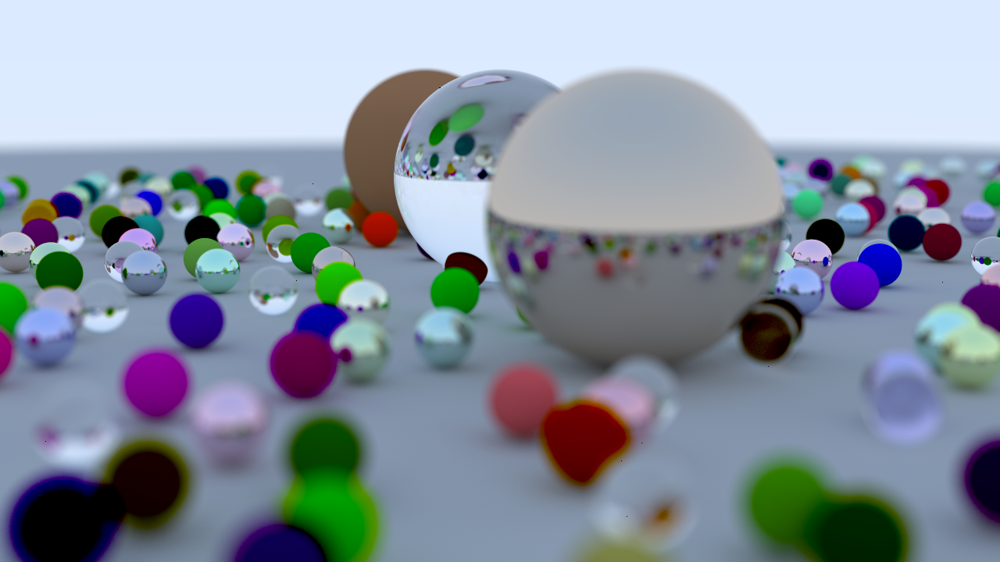
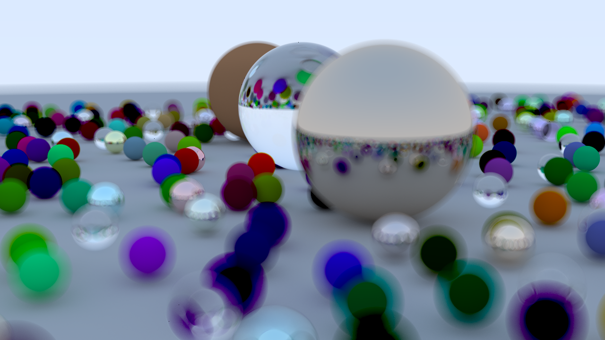

# Ray Tracing in One Weekend
An implementation of the famous book using the Odin programming language
---
- ~~Everything works right now except defocus blur~~
- We got it working!

- What it used to look like:

- No defocus blur 
